## 🧠 Hybrid Financial Fraud Detection Framework

A Semi-Supervised Model Combining Autoencoders and Supervised Machine Learning for Financial Fraud Detection.

-----

### ✨ Overview

In today's dynamic digital financial ecosystem, **detecting fraudulent transactions** is increasingly challenging due to the severe **class imbalance** (very few fraud cases) and the constant evolution of fraud tactics.

This project presents a **Hybrid Fraud Detection Framework** that strategically integrates **Autoencoder-based anomaly detection** (unsupervised) with powerful **supervised learning models**—specifically **Random Forest (RF)** and **XGBoost (XGB)**.

> **🎯 Primary Goal:** Improve fraud detection accuracy, significantly boost **Recall** for minority (fraudulent) transactions, and enhance adaptability to unseen, evolving fraud patterns while minimizing costly false negatives.

-----

### 🚀 Key Project Objectives

| Status |             Objective               |                                        Description                                              |
| :---:  | :---                                | :---                                                                                            |
| ✅     | **Hybrid Model Development**       | Combining Autoencoders (unsupervised feature engineering) and Supervised ML (classification).   |
| ✅     | **Imbalance Resolution**           | Effectively addressing the severe data imbalance using techniques like **SMOTE** or **ADASYN**. |
| ✅     | **Maximize Recall**                | Achieving a high capture rate for fraudulent transactions, which is critical in finance.        |
| ✅     | **Scalability & Interpretability** | Building a system ready for real-world deployment with clear, explainable results.              |

-----

### 🏛️ System Architecture & Workflow

The framework follows a robust five-stage pipeline:

```mermaid
flowchart LR
A["Input:<br>creditcard.csv"] --> B["Data Preprocessing &<br>Balancing"]
B --> C["Autoencoder Training:<br>Legitimate Transactions Only"]
C --> D["Feature Augmentation:<br>Add Reconstruction Error"]
D --> E["Supervised Learning:<br>Train RF & XGBoost"]
E --> F["Model Evaluation & Saving"]

%% --- Styles: professional corporate palette ---
style A fill:#E7EEF7,stroke:#1E3A8A,stroke-width:2px,color:#111
style B fill:#F0F4FF,stroke:#3B82F6,stroke-width:2px,color:#111
style C fill:#F9F0FF,stroke:#7C3AED,stroke-width:2px,color:#111
style D fill:#FFF5E5,stroke:#EAB308,stroke-width:2px,color:#111
style E fill:#EDF7FF,stroke:#2563EB,stroke-width:2px,color:#111
style F fill:#F4F4F5,stroke:#1E293B,stroke-width:2px,color:#111
```



1.  **Data Preprocessing**: Handling missing values, applying **`StandardScaler`** normalization.
2.  **Imbalance Correction**: Applying **SMOTE / ADASYN** to the training data.
3.  **Autoencoder Training**: Training a simple deep learning Autoencoder *only* on the **legitimate (non-fraudulent) transactions** to learn the "normal" pattern.
4.  **Feature Augmentation**: Calculating the **Reconstruction Error** for every transaction and adding it as a **synthetic feature** to the dataset.
5.  **Supervised Learning**: Training and hyperparameter tuning of **Random Forest** and **XGBoost** models on the augmented dataset.

-----

### 🛠️ Tools and Technologies

| Category          | Tools / Libraries                       |                        Purpose                          |
| :---              | :---                                    | :---                                                    |
| **Language**      | **Python 3.10+**                        | Core programming language.                              |
| **ML Frameworks** | `scikit-learn`, `xgboost`, `tensorflow` | Model building and training.                            |
| **Data Science**  | `pandas`, `numpy`                       | Data manipulation and numerical operations.             |
| **Visualization** | `matplotlib`, `seaborn`                 | Plotting ROC-AUC, PR-AUC, and Confusion Matrices.       |
| **Persistence**   | `joblib`, `h5`                          | Saving trained models and preprocessing objects.        |
| **Dataset**       | Kaggle – **Credit Card Fraud Detection Dataset** | Industry-standard imbalanced transaction data. |

-----

### 📊 Model Performance Summary

Models were rigorously evaluated using multiple metrics, focusing on **Recall** (capturing fraud) and **Precision** (avoiding false alarms).

|        Metric           | Random Forest (RF) | XGBoost (XGB) |           Better Mode              |
| :---                    | :---:              | :---:         | :---:                              |
| **Accuracy**            | **99.95%**         | 99.76%        | 🟩 **RF** (Lower FP/FN)            |
| **Precision (Fraud)**   | **95.00%**         | 41.35%        | 🟩 **RF** (Fewer False Positives)  |
| **Recall (Fraud)**      | 77.55%             | **87.76%**    | 🟦 **XGB** (More True Positives)   |
| **F1-Score (Fraud)**    | **0.85**           | 0.56          | 🟩 **RF** (Better overall balance) |
| **ROC-AUC** | 0.9623    | **0.9708**         | 🟦 **XGB** (Better separation capability)          |
| **PR-AUC** | **0.8685** | 0.8124             | 🟩 **RF** (Better high-precision performance)      |

#### Conclusion:

  * **Random Forest (RF)**: Achieved a significantly higher **Precision** (95.00%) and **F1-Score** (0.85), making it excellent for applications where minimizing **False Positives** (unnecessarily blocking legitimate transactions) is critical.
  * **XGBoost (XGB)**: Achieved a better **Recall** (87.76%), making it superior for applications where the primary goal is capturing the maximum number of **True Frauds** (minimizing False Negatives).
  * The hybrid approach successfully balances both needs, providing flexibility for deployment based on the business's risk tolerance.

-----

### 📈 Key Visualizations

Visual artifacts generated during the evaluation process provide clear evidence of model performance:

  * **ROC Curve**: Confirmed that XGBoost slightly outperformed RF in overall separability (higher ROC-AUC).
  * **Precision-Recall Curve**: Clearly illustrated the trade-off, showing RF maintaining higher precision across various recall thresholds.
  * **Confusion Matrix**: Demonstrated clear separation of fraud and non-fraud classes for both models.
  * **Reconstruction Error Distribution**: Visualized the Autoencoder's ability to create a distinct anomaly signal, confirming its effectiveness as a feature engineer.

-----

### 🔮 Future Enhancements (Roadmap)

| Priority   |        Enhancement           |                                                         Description                                                                         |
| :---:      | :---                         | :---                                                                                                                                        |
| **High**   | **Dynamic Hybrid Inference** | Re-engineer the model to integrate the Autoencoder output dynamically within a single, unified prediction pipeline for real-time scoring.   |
| **High**   | **SHAP Explainability**      | Implement **SHAP (SHapley Additive exPlanations)** to provide transparent, feature-level contribution analysis for every prediction.        |
| **Medium** | **Real-Time Deployment**     | Deploy the model logic as a high-throughput microservice using **FastAPI** or integrate with **Kafka** for streaming transaction detection. |
| **Low**    | **Interactive Interface**    | Develop a simple web interface (e.g., using Streamlit) for demonstration and testing of transaction scoring.                                |

-----

### 📂 Repository Structure

```
Hybrid-Fraud-Detection-Framework/
│
├── CreditCardFraudDetection.ipynb     # 🚀 Main Project Notebook (Full Workflow)
│
├── 💾 Models & Scalers/
│   ├── autoencoder_model.h5               # Saved Autoencoder model (for anomaly detection)
│   ├── rf_baseline.joblib                 # Random Forest model object
│   ├── xgb_baseline.json                  # XGBoost model object
│   └── scaler_all.joblib                  # Preprocessing StandardScaler object
│
└── 📄 Documentation/
    └── README.md                          # Project documentation
```

-----

### 🧾 Citation

If you use this framework or its concepts, please cite the work as:

```
J. Nakar (2025)
"Hybrid Fraud Detection Framework using Autoencoders and Supervised ML for Imbalanced Transaction Data."
```

-----

### 🙏 Acknowledgement

Developed under the guidance of Pro. Aswathy Nair, Department of Computer Engineering, Marwadi University, India.

-----

Would you like me to focus on creating a **detailed example** of the `CreditCardFraudDetection.ipynb` notebook structure or draft the **SHAP explainability** section for the future roadmap?
