```mermaid
flowchart LR
A["Input:<br>creditcard.csv"] --> B["Data Preprocessing:<br>Scaling & Cleaning"]
B --> C["Autoencoder Training:<br>Legitimate Data Only"]
C --> D["Reconstruction Error:<br>Generate Anomaly Scores"]
D --> E["Supervised Learning:<br>Train RF & XGBoost"]
E --> F["Model Evaluation:<br>Accuracy, Recall, AUC"]

%% --- Professional styling ---
style A fill:#E7EEF7,stroke:#1E3A8A,stroke-width:2px,color:#111
style B fill:#F0F4FF,stroke:#3B82F6,stroke-width:2px,color:#111
style C fill:#F9F0FF,stroke:#7C3AED,stroke-width:2px,color:#111
style D fill:#FFF5E5,stroke:#EAB308,stroke-width:2px,color:#111
style E fill:#EDF7FF,stroke:#2563EB,stroke-width:2px,color:#111
style F fill:#F4F4F5,stroke:#1E293B,stroke-width:2px,color:#111
```

## 🧠 Hybrid Fraud Detection Framework

A Semi-Supervised Model Combining Autoencoders and Supervised Machine Learning for Financial Fraud Detection.

---

### ✨ Overview

In today’s digital financial ecosystem, **fraud detection** remains a major challenge due to the extreme **class imbalance** between legitimate and fraudulent transactions.

This project proposes a **Hybrid Fraud Detection Framework** that integrates **Autoencoder-based anomaly detection** (unsupervised) with **supervised learning models** — namely **Random Forest (RF)** and **XGBoost (XGB)** — to improve detection of both known and unseen frauds.

> **🎯 Primary Goal:** Achieve higher recall for minority (fraudulent) transactions while minimizing false negatives and improving robustness against evolving fraud patterns.

---

### 🚀 Key Objectives

| Status | Objective                        | Description                                                                                 |
| :----: | :------------------------------- | :------------------------------------------------------------------------------------------ |
|    ✅   | **Model Development**            | Built baseline models using Random Forest and XGBoost on the preprocessed dataset.          |
|    ✅   | **Autoencoder Integration**      | Trained Autoencoder on legitimate transactions to generate anomaly (reconstruction) scores. |
|   🟡   | **Imbalance Handling (Planned)** | SMOTE / ADASYN implementation planned in the next phase to handle data imbalance.           |
|   🟡   | **Hybrid Enhancement (Planned)** | Integrate reconstruction error and supervised models into a unified hybrid pipeline.        |
|   🔲   | **Explainability & Real-Time**   | Future stage: SHAP-based interpretability and API/Streamlit deployment.                     |

---

### 🏛️ System Architecture



---

### 🛠️ Tools & Technologies

| Category          | Tools / Libraries                            |
| :---------------- | :------------------------------------------- |
| **Language**      | Python 3.10+                                 |
| **ML Libraries**  | scikit-learn, xgboost, tensorflow            |
| **Data Handling** | pandas, numpy                                |
| **Visualization** | matplotlib, seaborn                          |
| **Model Saving**  | joblib, h5                                   |
| **Dataset**       | Kaggle – Credit Card Fraud Detection Dataset |

---

### 📊 Model Performance Summary

| Metric                | Random Forest |   XGBoost  | Best Model |
| :-------------------- | :-----------: | :--------: | :--------: |
| **Accuracy**          |   **99.95%**  |   99.76%   |    🟩 RF   |
| **Precision (Fraud)** |   **95.00%**  |   41.35%   |    🟩 RF   |
| **Recall (Fraud)**    |     77.55%    | **87.76%** |   🟦 XGB   |
| **F1-Score (Fraud)**  |    **0.85**   |    0.56    |    🟩 RF   |
| **ROC-AUC**           |     0.9623    | **0.9708** |   🟦 XGB   |
| **PR-AUC**            |   **0.8685**  |   0.8124   |    🟩 RF   |

**Interpretation:**

* RF excels in **precision** and overall balance (best for low false alarms).
* XGB offers higher **recall**, capturing more frauds (fewer missed cases).
* The hybrid concept aims to **combine both strengths** in the next iteration.

---

### 📈 Visualizations

* **ROC Curve** – XGBoost achieves slightly higher separability.
* **Precision-Recall Curve** – Random Forest maintains better precision at higher recall.
* **Confusion Matrix** – Strong classification performance for both models.
* **Reconstruction Error Distribution** – Confirms Autoencoder’s anomaly signal effectiveness.

---

### 🔮 Future Enhancements

| Priority | Enhancement                     | Description                                                                   |
| :------: | :------------------------------ | :---------------------------------------------------------------------------- |
|    🟡    | **SMOTE / ADASYN Integration**  | Balance the dataset to reduce bias toward legitimate transactions.            |
|    🟡    | **Hybrid Inference**            | Merge Autoencoder outputs directly into model training for unified detection. |
|    🟢    | **Hyperparameter Optimization** | Fine-tune XGB/RF parameters for optimal recall.                               |
|    🟣    | **SHAP Explainability**         | Add SHAP-based interpretability to visualize feature importance.              |
|    🟢    | **Real-Time Deployment**        | Build a simple interface (e.g., Streamlit or FastAPI).                        |

---

### 📂 Repository Structure

```
Hybrid-Fraud-Detection-Framework/
│
├── CreditCardFraudDetection.ipynb      # Main notebook
├── autoencoder_model.h5                # Saved Autoencoder model
├── rf_baseline.joblib                  # Random Forest model
├── xgb_baseline.json                   # XGBoost model
├── scaler_all.joblib                   # Data scaler
└── README.md                           # Documentation
```

---

### 🧾 Citation

**J. Nakar (2025)**
“Hybrid Fraud Detection Framework using Autoencoders and Supervised ML for Imbalanced Transaction Data.”

---

### 🙏 Acknowledgement

Developed under the guidance of **Prof. Aswathy Nair**,
Department of Computer Engineering, **Marwadi University**, India.

---
